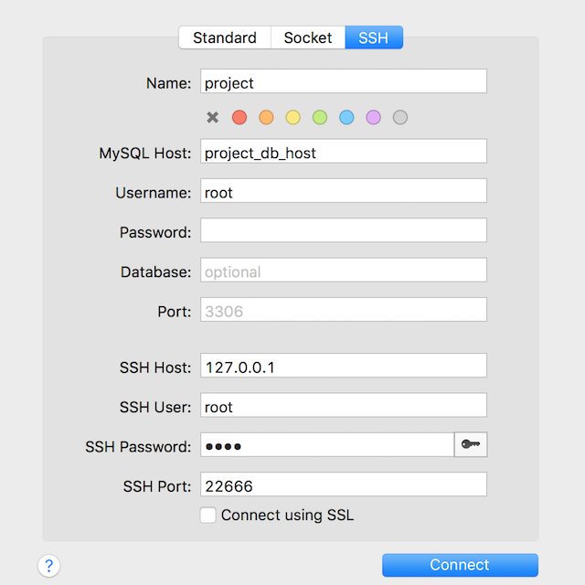

[](https://opensource.org/licenses/MIT)

# Docker DB tunnel

Simple tool to avoid an exposed container port conflicts when using databases in multiple docker projects. 
Main idea is to use the ssh tunnel and connect all databases to one network with sshd container.  


Inspired by [nginx-proxy](https://github.com/jwilder/nginx-proxy) Automated Nginx Reverse Proxy for Docker.  
It uses [sickp/alpine-sshd](https://hub.docker.com/r/sickp/alpine-sshd/) A lightweight OpenSSH Docker Image built atop Alpine..

## Install

Download via

```shell
git clone https://github.com/speto/docker-db-tunnel
```

## Usage

Run shell script to create sshd container, network and connect sshd and all db containers:

```shell
$ ./docker-db-tunnel.sh
Running db tunnel container db-tunnel-sshd on port 22666
668e40197c800a612ea748b9778d3f0888333673f7588d4a0bb1e027bd5d22d4
Creating db tunnel network: db-tunnel-network
164e5a3c3b446169f928a03c135594493843664fef5ffa3edf820dd5de06f0a1
Connecting db-tunnel-sshd to db-tunnel-network
Connecting symfony-demo_mariadb_1 to db-tunnel-network
Connecting symfony-demo2_mariadb_1 to db-tunnel-network
Connecting project_mysql_1 to db-tunnel-network with hostname (alias) project_db_host
```

### Docker-compose services example

Uses [bianjp/mariadb-alpine](https://hub.docker.com/r/bianjp/mariadb-alpine/) Lightweight MariaDB docker image based on Alpine Linux.  
Fully compatible with [official MariaDB image](https://hub.docker.com/_/mariadb/)

docker-compose-project.yml
```yaml
services:
  project_mysql:
    container_name: project_mysql_1
    image: bianjp/mariadb-alpine:latest
    environment:
      - MYSQL_ALLOW_EMPTY_PASSWORD=yes
    labels:
      - db.network.tunnel.hostname=project_db_host
```

docker-compose-symfony-demo.yml
```yaml
services:
  symfony-demo_mariadb:
    container_name: symfony-demo_mariadb_1
    image: bianjp/mariadb-alpine:latest
    environment:
    - MYSQL_ALLOW_EMPTY_PASSWORD=yes
```

### SSH Tunnel settings
The **root** password for SSH is in `sickp/alpine-sshd` "**root**".  
You can also [change default root password](https://github.com/sickp/docker-alpine-sshd#change-root-password).

### Connection settings example

```
MySQL host: project_mysql_1 
# or via alias 
# MySQL host: project_db_host
Username: root
Port: 3306

SSH Host: 127.0.0.1
SSH User: root
SSH Password: root
SSH Port: 22666
```



## Customize

It is easy to extend via your own .env file:

```dotenv
DB_TUNNEL_NETWORK=db-tunnel-network
DB_TUNNEL_NETWORK_HOSTNAME_LABEL=db.network.tunnel.hostname
DB_TUNNEL_CONTAINER_NAME=db-tunnel-sshd
DB_TUNNEL_CONTAINER_PORT=22666
DB_CONTAINER_NAME_PATTERN="mariadb|mysql" #pattern for docker ps filtering
```

### MIT license

Copyright (c) 2018, Štefan Peťovský